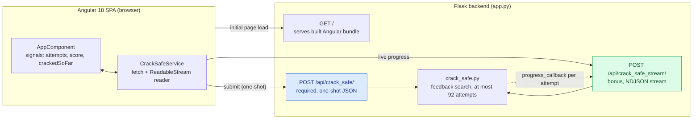
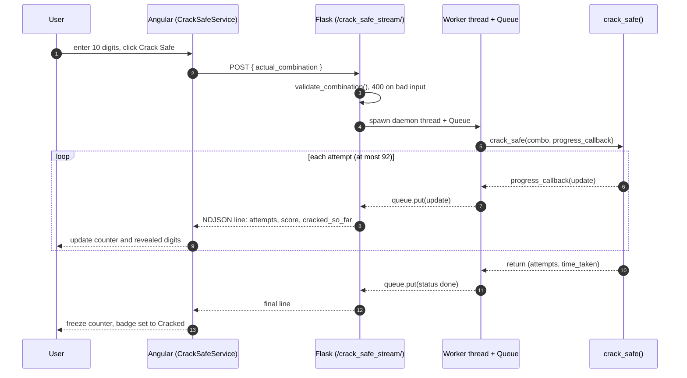

# Crack Safe: Full-Stack Application

An Angular 18 frontend and a Flask backend that service the Part 1 `crack_safe`
function. The backend cracks any 10-digit combination in at most 92 attempts
using the feedback tool, and the frontend shows the cracking progress in real
time.

<p>
  
  
  
  
  
</p>

> Live demo: **https://crack-safe.onrender.com/**
> (free instance; the first request after idle takes a few seconds to wake)

## Overview

The user enters the true 10-digit combination. The Angular UI sends it to the
Flask backend, which runs `crack_safe` and streams progress back: attempt count,
per-digit reveal, score, and a progress bar. The counter stops as soon as the
safe is cracked, showing the final `attempts` and `time_taken`.

The algorithm is not brute force. Instead of searching the 10 billion possible
combinations, it uses the feedback tool (how many digits sit in the correct
position) to determine each digit independently, giving a worst case of 92
attempts. The UI dramatizes this with a live count of combinations eliminated
and a side-by-side comparison against brute force.

### Requirements coverage

| Area | Requirement | Status |
|------|-------------|:------:|
| Backend | Flask, `POST /api/crack_safe/` accepting `actual_combination` | Done |
| Backend | Returns `{ attempts, time_taken }` as JSON | Done |
| Frontend | Angular form with an input and a submit button | Done |
| Frontend | Displays the results returned from the backend | Done |
| Ultra bonus | Live attempt counter, updated in real time | Done |
| Ultra bonus | Counter freezes once the safe is cracked | Done |
| Extra | See highlights below | Done |

### Highlights beyond the spec

- Keyspace visualization: a live count of combinations ruled out, computed as
  `10^10 - 10^(10 - known digits)`, next to a smart-search vs brute-force
  comparison (attempts, projected time, and speedup factor).
- Per-digit safe display: 10 cells that light up as each position is solved,
  with the active position highlighted while it is being probed.
- Interactive controls: an animation-speed slider (which paces the backend
  stream), quick-fill buttons (random, worst case, best case), and a
  light/dark theme toggle.
- Backend result caching, a production Dockerfile, and CI (see below).
- Accessibility: `aria-live` on the live counters and reduced-motion support.

## Architecture



The Angular app is built into Flask's `static/` folder, so a single
`python app.py` serves both the API and the UI from the same origin, with no
CORS needed in production. In development, Angular runs on port 4200 and proxies
`/api` to Flask on port 5000 for hot reload.

## Request lifecycle (streaming endpoint)

The live counter is powered by a newline-delimited JSON (NDJSON) stream over a
single HTTP response. There are no WebSockets and no polling. Flask runs the
cracker in a worker thread and pushes one line per attempt through a queue.



## Algorithm

The safe exposes a feedback tool `sound_tool(guess)` that returns how many
digits are correct and in the correct position. The cracker uses it to solve
each of the 10 positions independently:

1. Baseline. Guess `0000000000` and record `base_score`, the number of
   positions that already hold a `0`.
2. Probe each position. For position i, try changing it to `1, 2, ... 9`:
   - score becomes `base_score + 1`: that digit is the answer for position i.
   - score becomes `base_score - 1`: the position was a `0` (the probe broke a
     match).
   - score unchanged: keep trying.
3. Verify the reconstructed combination.

### Attempt count

For a digit `d` at a position, the probe loop costs `d` tries if `d` is 1 to 9,
or 1 try if `d` is 0 (the first probe reveals it). Add 1 baseline and 1
verification:

```
attempts = 1 + sum(f(d_i)) + 1     where f(d) = d if d != 0, else 1
```

| Combination | Per-position cost | Total |
|-------------|-------------------|:-----:|
| `0800666666` | 1+8+1+1+6+6+6+6+6+6 = 47 | 49 |
| `9999999999` (worst case) | 9 x 10 = 90 | 92 |
| `0000000000` (best case) | 1 x 10 = 10 | 12 |

In combination space this is constant work (at most 92 tool calls regardless of
the 10-billion keyspace), compared with 10^10 for brute force.

A stress test runs 3,005 combinations (all edge cases plus 3,000 random). Every
one is solved correctly, with at most 92 attempts and no failures.

## Tech stack

| Layer | Choice | Notes |
|-------|--------|-------|
| Backend | Flask 3.0 + flask-cors | Thin API; streaming via generator and threaded worker |
| Core | Python 3.13, no dependencies | Portable, unit-tested in isolation |
| Frontend | Angular 18, standalone components | Signals for reactive state, `@if` control flow |
| Streaming | fetch + ReadableStream, wrapped in an RxJS Observable | Cancelable via AbortController on unsubscribe |
| Styling | Hand-written CSS, dark + light theme via CSS variables | Global stylesheet, no UI framework |
| Tests | pytest (backend), Karma/Jasmine (frontend) | 17 backend tests: algorithm + API endpoints, caching, validation |

## Project structure

```text
crack-safe/
├── app/                          # Flask backend
│   ├── app.py                    #   API, result cache, streaming endpoint, serves Angular
│   ├── crack_safe.py             #   Part 1 algorithm (pure, dependency-free)
│   └── static/                   #   Angular production build output (generated)
├── frontend/                     # Angular source
│   ├── src/app/
│   │   ├── app.component.ts       #   UI logic: signals, keyspace + comparison, live updates
│   │   ├── app.component.html     #   template: form, controls, metrics, safe display
│   │   └── crack-safe.service.ts  #   API client: one-shot + streaming
│   ├── src/styles.css             #   global styling, dark + light theme
│   ├── proxy.conf.json            #   dev proxy: /api to Flask :5000
│   └── angular.json               #   build outputs into ../app/static
├── tests/
│   ├── test_crack_safe.py        # algorithm unit + parametrized tests
│   └── test_api.py               # endpoint, caching, and validation tests
├── .github/workflows/ci.yml      # CI: backend tests, frontend build, docker build
├── Dockerfile                    # multi-stage: Node build -> gunicorn runtime
├── docker-compose.yml
├── render.yaml                   # Render deploy blueprint
├── requirements.txt
└── README.md
```

## API reference

### `POST /api/crack_safe/` (required, one-shot)

```bash
curl -X POST http://127.0.0.1:5000/api/crack_safe/ \
  -H "Content-Type: application/json" \
  -d '{"actual_combination":"0800666666"}'
```

```json
{ "attempts": 49, "time_taken": 0.000056, "cached": false }
```

Results are memoized (the function is deterministic), so a repeat request for
the same combination returns `"cached": true` without recomputing.

| Case | Response |
|------|----------|
| Valid 10 digits | `200` with `{ attempts, time_taken, cached }` |
| Not 10 digits, non-numeric, or missing | `400` with `{ "error": "actual_combination must be exactly 10 digits" }` |

### `POST /api/crack_safe_stream/` (bonus, live stream)

Body accepts `actual_combination` and an optional `step_delay` (seconds per
attempt, clamped to `0`–`0.1`; the frontend's speed slider sets it). Responds
with `application/x-ndjson`, one JSON object per line:

```json
{"status":"running","attempts":8,"guess":"0800000000","score":2,"cracked_so_far":"0800??????"}
{"status":"done","attempts":49,"time_taken":0.000061}
```

Note: the streamed `time_taken` includes the pacing delay so the counter is
visible. The required one-shot endpoint reports the true, un-throttled compute
time, which is what the comparison panel uses.

## Running it

### Single server (recommended, no build step)

The Angular app is pre-built into `app/static`, so Flask serves everything.

```bash
python -m venv venv
source venv/bin/activate          # Windows: venv\Scripts\activate
pip install -r requirements.txt
cd app && python app.py
```

Open http://127.0.0.1:5000

### Development mode (hot reload)

```bash
# Terminal 1: backend
cd app && python app.py                    # :5000

# Terminal 2: Angular dev server (proxies /api)
cd frontend && npm install && npm start    # :4200
```

Rebuild the frontend bundle after editing Angular source:

```bash
cd frontend && npm run build               # outputs to ../app/static
```

### Docker

A multi-stage build compiles the Angular app and serves it, together with the
API, from a production WSGI server (gunicorn):

```bash
docker compose up --build                  # http://127.0.0.1:5000
```

### Deploy to Render

The live demo above runs on Render. The repo includes `render.yaml`, so it
deploys as a Docker web service: on Render, choose New, then Blueprint, and
point it at this repo. Render reads `render.yaml`, builds the Dockerfile, and
starts gunicorn on its injected `$PORT`. The free instance sleeps when idle, so
the first request after a pause takes a few seconds to wake.

## Testing

```bash
python -m pytest            # backend: 17 passed
cd frontend && npm test     # frontend: component + validation specs
```

Backend coverage includes the algorithm (sample combination, parametrized edge
cases, input-validation rejections) and the API (endpoint result shape, cache
hit on a repeat request, and `400`s on bad input).

## Design decisions

- Streaming without WebSockets. NDJSON over a single HTTP response is the
  minimal way to get real-time updates. It works with `fetch`, is cancelable,
  and passes through the dev proxy.
- Threaded producer with a queue consumer. The cracker runs in a daemon thread
  and feeds a `queue.Queue`; the Flask generator drains it. This keeps the
  response streaming while computation proceeds, and a sentinel value signals
  completion.
- Signals for state. UI state lives in `signal()`s with `computed()`
  derivations (progress percentage, status label), which avoids manual change
  detection.
- Progress relative to the worst case. The bar is scaled against the known
  92-attempt ceiling rather than an arbitrary value.
- Client-controlled pacing. The stream's per-attempt delay is a request
  parameter, clamped server-side, so one endpoint serves both a fast read and a
  slow, watchable animation without changing the compute.
- Keyspace framing. The UI derives combinations eliminated and a brute-force
  comparison from the same stream, making the algorithm's constant-work property
  visible instead of just stated.
- Themed and accessible. Colors are CSS variables with a light/dark toggle; live
  counters use `aria-live` and animations respect `prefers-reduced-motion`.
- Validation on both sides. Digits-only sanitization on the client, plus an
  authoritative `validate_combination()` on the server that returns `400` on
  bad input.
- Single build artifact. `ng build` outputs into Flask's static directory, so
  one command runs the whole app from a single origin.
- Transport-independent core. `crack_safe.py` has no web dependencies and is
  unit-tested on its own.

## Possible next steps

- Add a property-based test (Hypothesis) asserting at most 92 attempts across
  random combinations.
- Add an end-to-end test (Playwright) asserting the counter freezes on crack.
- Back the result cache with Redis so it survives restarts and is shared across
  instances.
- Offer Server-Sent Events as an alternative transport with auto-reconnect.
