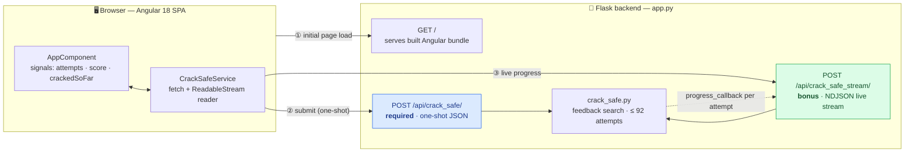
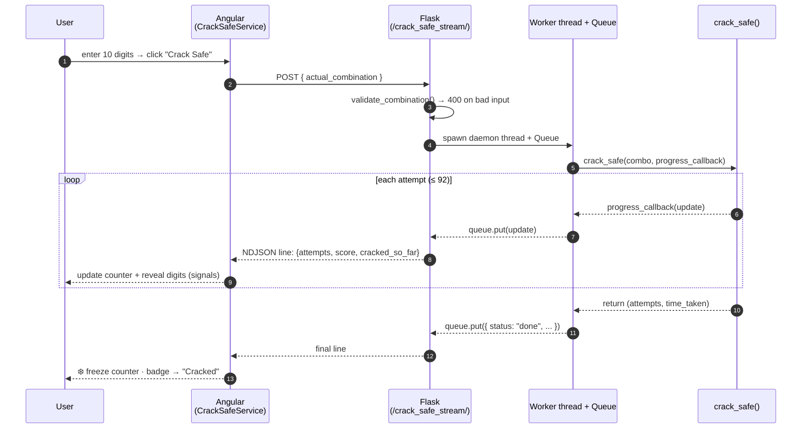

# 🔐 Crack Safe — Full-Stack Application

> A full-stack service around the Part 1 `crack_safe` function: an **Angular 18** frontend talking to a **Flask** backend that cracks any 10-digit safe in **≤ 92 attempts** — with a **real-time**, streaming progress counter.

<p>
  
  
  
  
  
</p>

---

## 1. What this is (30-second version)

Enter the true 10-digit combination → the Angular UI streams the backend's cracking process live (attempt counter, per-digit "safe screen", score, progress bar) → the counter **freezes** the instant the safe is cracked, showing final `attempts` and `time_taken`.

The core is **not** brute force. Instead of searching 10¹⁰ combinations, it uses the feedback tool (how many digits are in the right position) to isolate each digit independently — solving in a provable worst case of **92 attempts**.

### Requirements coverage

| # | Requirement | Status |
|---|-------------|:------:|
| Backend | Flask, `POST /api/crack_safe/` accepting `actual_combination` | ✅ |
| Backend | Returns `{ attempts, time_taken }` as JSON | ✅ |
| Frontend | Angular form + input + submit button | ✅ |
| Frontend | Displays results returned from the backend | ✅ |
| 🌟 Ultra Bonus | Live attempt counter, updated in real time | ✅ |
| 🌟 Ultra Bonus | Counter **freezes** once the safe is cracked | ✅ |
| 🌟 Extra | Per-digit reveal, score, progress bar, input sanitization, single-command deploy | ✅ |

---

## 2. System architecture



**One deployable unit.** The Angular app is built into Flask's `static/` folder, so a single `python app.py` serves both the API and the UI from the same origin (no CORS needed in production). In dev, Angular runs on `:4200` and proxies `/api` to Flask on `:5000` for hot reload.

---

## 3. Request lifecycle — the real-time stream

The bonus counter is powered by a lightweight **NDJSON stream** (newline-delimited JSON over a single HTTP response) — no WebSockets, no polling. Flask runs the cracker in a worker thread and pushes one line per attempt through a queue:



---

## 4. The algorithm (why it's clever, not brute force)

The safe exposes a feedback tool `sound_tool(guess)` → number of digits that are correct **and** in the correct position. The cracker exploits this to solve each of the 10 positions **independently**:

1. **Baseline.** Guess `0000000000` and record `base_score` (how many positions already hold a `0`).
2. **Probe each position.** For position *i*, try changing it to `1, 2, … 9`:
   - score becomes `base_score + 1` → that digit is the answer for position *i* (found it).
   - score becomes `base_score − 1` → the position was a `0` all along (the probe broke a match).
   - score unchanged → keep trying.
3. **Verify** the reconstructed combination.

### Attempt count

For a digit `d` at a position, the probe loop costs `d` tries if `d ∈ 1..9`, or `1` try if `d = 0` (the first probe immediately reveals it). Plus 1 baseline + 1 verification:

```
attempts = 1  +  Σ f(dᵢ)  +  1        where  f(d) = d if d≠0, else 1
```

| Combination | Per-position cost | Total |
|-------------|-------------------|:-----:|
| `0800666666` | 1+8+1+1+6+6+6+6+6+6 = 47 | **49** |
| `9999999999` (worst case) | 9 × 10 = 90 | **92** |
| `0000000000` (best case) | 1 × 10 = 10 | **12** |

**Complexity:** `O(1)` in combination space (≤ 92 calls regardless of the 10-billion keyspace) vs. `O(10¹⁰)` for brute force.

> **Correctness is verified empirically:** a stress test cracks 3,005 combinations (all edge cases + 3,000 random) — every one solved correctly, max 92 attempts, zero failures.

---

## 5. Tech stack

| Layer | Choice | Notes |
|-------|--------|-------|
| Backend | **Flask 3.0** + flask-cors | Thin API; streaming via generator + threaded worker |
| Core | Pure **Python 3.13** | No deps — portable, unit-tested in isolation |
| Frontend | **Angular 18** (standalone components) | Modern **signals** for reactive state, `@if` control flow |
| Streaming | **fetch + ReadableStream** → RxJS `Observable` | Cancelable via `AbortController` on unsubscribe |
| Styling | Hand-written CSS (dark, glassmorphism) | Global stylesheet; no UI framework bloat |
| Tests | **pytest** (backend) · Karma/Jasmine (frontend) | 10 backend tests incl. parametrized edge cases |

---

## 6. Project structure

```text
crack-safe/
├── app/                          # 🐍 Flask backend
│   ├── app.py                    #    API + serves built Angular; streaming endpoint
│   ├── crack_safe.py             #    Part 1 algorithm (pure, dependency-free)
│   └── static/                   #    Angular production build output (generated)
├── frontend/                     # 🅰️ Angular source
│   ├── src/app/
│   │   ├── app.component.ts       #    UI logic — signals, live-update handling
│   │   ├── app.component.html     #    template — form, metrics, progress
│   │   └── crack-safe.service.ts  #    API client: one-shot + streaming
│   ├── proxy.conf.json            #    dev proxy: /api → Flask :5000
│   └── angular.json               #    build outputs into ../app/static
├── tests/
│   └── test_crack_safe.py        #    unit + parametrized correctness tests
├── requirements.txt
└── README.md
```

---

## 7. API reference

### `POST /api/crack_safe/` — required, one-shot

```bash
curl -X POST http://127.0.0.1:5000/api/crack_safe/ \
  -H "Content-Type: application/json" \
  -d '{"actual_combination":"0800666666"}'
```

```json
{ "attempts": 49, "time_taken": 0.000056 }
```

| Case | Response |
|------|----------|
| Valid 10 digits | `200` `{ attempts, time_taken }` |
| Not 10 digits / non-numeric / missing | `400` `{ "error": "actual_combination must be exactly 10 digits" }` |

### `POST /api/crack_safe_stream/` — bonus, live stream

Same request body. Responds `application/x-ndjson`, one JSON object per line:

```json
{"status":"running","attempts":8,"guess":"0800000000","score":2,"cracked_so_far":"0800??????"}
{"status":"done","attempts":49,"time_taken":0.000061}
```

> **Design note:** the streamed `time_taken` is slightly larger than the one-shot endpoint's, because the stream deliberately paces updates (~15 ms/attempt) so the counter is humanly visible. The **required** endpoint reports true, un-throttled compute time.

---

## 8. Run it

### Option A — single server (recommended, zero build)

The Angular app is pre-built into `app/static`, so Flask serves everything:

```bash
python -m venv venv
source venv/bin/activate          # Windows: venv\Scripts\activate
pip install -r requirements.txt
cd app && python app.py
```

→ open **http://127.0.0.1:5000**

### Option B — dev mode (hot reload)

```bash
# Terminal 1 — backend
cd app && python app.py                    # :5000

# Terminal 2 — Angular dev server (proxies /api)
cd frontend && npm install && npm start    # :4200
```

Rebuild the frontend bundle after editing Angular source:

```bash
cd frontend && npm run build               # outputs to ../app/static
```

---

## 9. Testing

```bash
python -m pytest            # backend: 10 passed
cd frontend && npm test     # frontend: component + validation specs
```

Backend coverage: the sample combination, parametrized edge cases (all-zeros, all-nines, sequential), and input-validation rejections.

---

## 10. Design decisions & unique touches

- **Streaming without WebSockets.** NDJSON over a single HTTP response is the minimal way to get real-time updates — trivially compatible with `fetch`, cancelable, and proxy-friendly.
- **Threaded producer / queue consumer.** The cracker runs in a daemon thread and feeds a `queue.Queue`; the Flask generator drains it. This keeps the request streaming while compute proceeds, and cleanly signals completion with a sentinel.
- **Signals-first Angular.** State lives in `signal()`s with `computed()` derivations (progress %, status label) — no manual change detection, no RxJS state juggling in the component.
- **Progress bounded by theory.** The bar is scaled against the *known* 92-attempt ceiling, so it's a meaningful fraction of the true worst case rather than a fake spinner.
- **Defense in depth on input.** Digits-only sanitization on the client, plus authoritative `validate_combination()` on the server returning proper `400`s.
- **Single-artifact deploy.** `ng build` emits straight into Flask's static dir → one command, same-origin, no production CORS surface.
- **Algorithm isolated from transport.** `crack_safe.py` has zero web dependencies and is unit-tested on its own, so the interesting logic is decoupled and portable.

## 11. Possible next steps

- Cache results per combination (memoize `crack_safe`) — deterministic output makes this a free win.
- Containerize with a multi-stage Dockerfile (Node build stage → slim Python runtime).
- Server-Sent Events as an alternative transport with auto-reconnect.
- E2E test (Playwright) asserting the counter freezes on crack.
